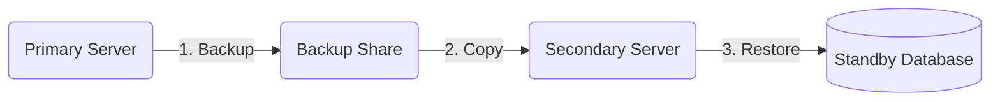

# Log Shipping Setup

> **Environment context:** These procedures were developed for SQL Server environments using log shipping as the primary disaster recovery strategy, shipping transaction logs from a primary data center to a geographically separate secondary site.

## Table of Contents

- [Overview](#overview)
- [Prerequisites](#prerequisites)
- [Schedule Recommendations](#schedule-recommendations)
- [Setup via SSMS](#setup-via-ssms)
- [Setup via dbatools](#setup-via-dbatools)
- [Copy SQL Server Objects to the Secondary](#copy-sql-server-objects-to-the-secondary)
- [Monitoring Log Shipping](#monitoring-log-shipping)
- [Failover Procedures](#failover-procedures)

## Overview

Log shipping maintains a warm standby copy of one or more databases by continuously backing up transaction logs on the primary server, copying them to the secondary server, and restoring them. The process involves three SQL Agent jobs:

1. **Backup job** (runs on the primary) — backs up the transaction log to a shared location.
2. **Copy job** (runs on the secondary) — copies the log backup files from the shared location to a local folder on the secondary.
3. **Restore job** (runs on the secondary) — restores the copied log backups to the secondary database.



The secondary database remains in either **NORECOVERY** or **STANDBY** mode until a failover is needed. STANDBY mode allows read-only access to the secondary, which can be useful for reporting, but each restore cycle will disconnect active readers.

## Prerequisites

- The database must be in **Full** or **Bulk-Logged** recovery model. Simple recovery model does not generate transaction log backups.
- A network share accessible by both the primary and secondary SQL Server service accounts for log backup file transfer.
- SQL Server Agent must be running on both servers.
- The service accounts on both servers need read/write access to the backup share.

Verify the recovery model of your databases:

```sql
SELECT name, recovery_model_desc
FROM sys.databases
WHERE database_id > 4;
```

```powershell
Get-DbaDbRecoveryModel -SqlInstance PrimaryServer01 -ExcludeSystemDb
```

If any databases need to be changed to Full recovery:

```sql
ALTER DATABASE [DatabaseName] SET RECOVERY FULL;
```

```powershell
Set-DbaDbRecoveryModel -SqlInstance PrimaryServer01 -Database DatabaseName -RecoveryModel Full
```

## Schedule Recommendations

The schedule for each job should align with your Recovery Point Objective (RPO) and Recovery Time Objective (RTO).

| Job | Recommended Frequency | Notes |
|---|---|---|
| Backup | Every 5 minutes | Keeps potential data loss window small. |
| Copy | Every 5 minutes | Should match or closely follow the backup schedule. |
| Restore | Every 2–4 hours | Can be more frequent if a tighter RTO is needed. Frequent restores on STANDBY databases will interrupt read-only users. |

These are starting points. Adjust based on transaction volume, network bandwidth between sites, and your SLA requirements.

## Setup via SSMS

The SSMS wizard is the most straightforward approach. Rather than reproducing the wizard steps here, this guide covers the process well:

[How to create SQL Server Log Shipping using SSMS](https://www.sqlshack.com/create-sql-server-log-shipping/)

While log shipping can be scripted entirely in T-SQL, it's a multi-step process requiring commands on both the primary and secondary servers. If a single step is missed, initialization will fail. The SSMS wizard or the dbatools method below are more reliable approaches.

## Setup via dbatools

The [`Invoke-DbaDbLogShipping`](https://docs.dbatools.io/#Invoke-DbaDbLogShipping) command configures the same backup, copy, and restore jobs that the SSMS wizard creates — without needing to open SSMS or click through the wizard.

The following example loops through all user databases on the primary server and configures log shipping to the secondary:

```powershell
$cred = Get-Credential "$env:USERDOMAIN\$env:USERNAME"
# Exclude utility and infrastructure databases that don't need log shipping
$databases = Get-DbaDatabase -SqlInstance PrimaryServer01 -ExcludeSystem `
    -ExcludeDatabase ReportServer, ReportServerTempDB, DBAOps, SSISDB |
    Select-Object -ExpandProperty Name |
    Sort-Object

foreach ($db in $databases) {
    $params = @{
        SourceSqlInstance                = 'PrimaryServer01'
        SourceSqlCredential             = $cred
        DestinationSqlInstance          = 'SecondaryServer01'
        DestinationSqlCredential        = $cred
        Database                        = $db
        SharedPath                      = '\\PrimaryServer01\Backups\LogShipping\Source'
        LocalPath                       = 'X:\Backups\LogShipping\Source'
        BackupScheduleFrequencyType     = 'Daily'
        BackupScheduleFrequencyInterval = 1
        BackupScheduleFrequencySubdayType     = 'Minutes'
        BackupScheduleFrequencySubdayInterval = 5
        CompressBackup                  = $true
        GenerateFullBackup              = $true
        CopyDestinationFolder           = '\\SecondaryServer01\Backups\LogShipping\Destination'
        CopyScheduleFrequencyType       = 'Daily'
        CopyScheduleFrequencyInterval   = 1
        CopyScheduleFrequencySubdayType       = 'Minutes'
        CopyScheduleFrequencySubdayInterval   = 5
        RestoreAlertThreshold           = 300
        RestoreScheduleFrequencyType    = 'Daily'
        RestoreScheduleFrequencyInterval = 1
        RestoreScheduleFrequencySubdayType     = 'Hours'
        RestoreScheduleFrequencySubdayInterval = 4
    }
    Invoke-DbaDbLogShipping @params
}
```

Key parameters to pay attention to:

- `SharedPath` — the UNC path where the primary writes log backups. Both servers must have access.
- `LocalPath` — the local path on the primary that maps to the `SharedPath` UNC.
- `GenerateFullBackup` — when `$true`, takes a fresh full backup to initialize the secondary. Set to `$false` if you want to initialize from an existing backup.
- `RestoreAlertThreshold` — minutes before an alert fires if restores fall behind (300 = 5 hours).

## Copy SQL Server Objects to the Secondary

Log shipping only replicates database contents. It does **not** transfer server-level objects such as logins, Agent jobs, linked servers, or other configurations. If you need to bring the secondary online for DR, these objects must already be in place.

The [`Start-DbaMigration`](https://docs.dbatools.io/#Start-DbaMigration) command copies all server-level objects from one instance to another. The `-Exclude Databases` flag skips the databases themselves (since log shipping handles those).

```powershell
$params = @{
    Source      = 'PrimaryServer01'
    Destination = 'SecondaryServer01'
    Exclude     = 'Databases'
}

Start-DbaMigration @params -Verbose
```

This copies:

- Logins (including SID mapping to avoid orphaned users)
- SQL Agent jobs, operators, and alerts
- Linked servers
- Database mail configuration
- Credentials
- Server configuration settings (sp_configure)
- Audits, endpoints, and extended events
- Custom error messages
- Startup procedures
- All other server-level objects

Run this periodically — any logins or Agent jobs created on the primary after the initial copy won't exist on the secondary until you run it again. Consider scheduling this as a weekly or monthly maintenance task:

```powershell
# Sync just logins (lightweight, good for frequent runs)
Copy-DbaLogin -Source PrimaryServer01 -Destination SecondaryServer01

# Sync Agent jobs
Copy-DbaAgentJob -Source PrimaryServer01 -Destination SecondaryServer01
```

## Monitoring Log Shipping

Log shipping status should be monitored to catch backup, copy, or restore failures before they become a DR gap.

Check the current state of log shipping on the secondary:

```sql
SELECT
    secondary_database,
    last_copied_file,
    last_copied_date,
    last_restored_file,
    last_restored_date,
    last_restored_latency
FROM msdb.dbo.log_shipping_monitor_secondary;
```

```powershell
Get-DbaDbLogShipError -SqlInstance SecondaryServer01

# Check overall log shipping status
Invoke-DbaQuery -SqlInstance SecondaryServer01 -Database msdb -Query @"
SELECT
    secondary_database,
    last_copied_file,
    last_copied_date,
    last_restored_file,
    last_restored_date,
    last_restored_latency
FROM dbo.log_shipping_monitor_secondary;
"@
```

Key things to watch for: `last_restored_latency` climbing beyond your alert threshold, and gaps between `last_copied_date` and `last_restored_date` that exceed your restore schedule interval.

## Failover Procedures

For detailed failover, failback, and traffic redirection procedures, see [Log Shipping Failover and Failback Procedures](LogShippingFailover.md).